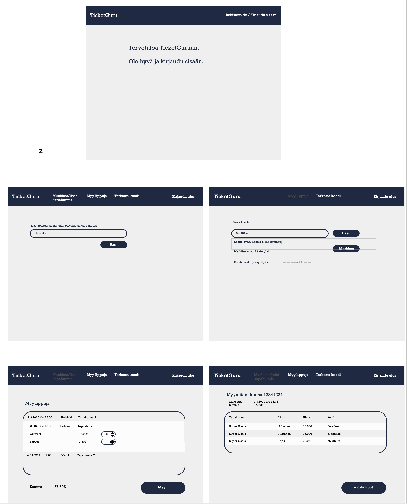
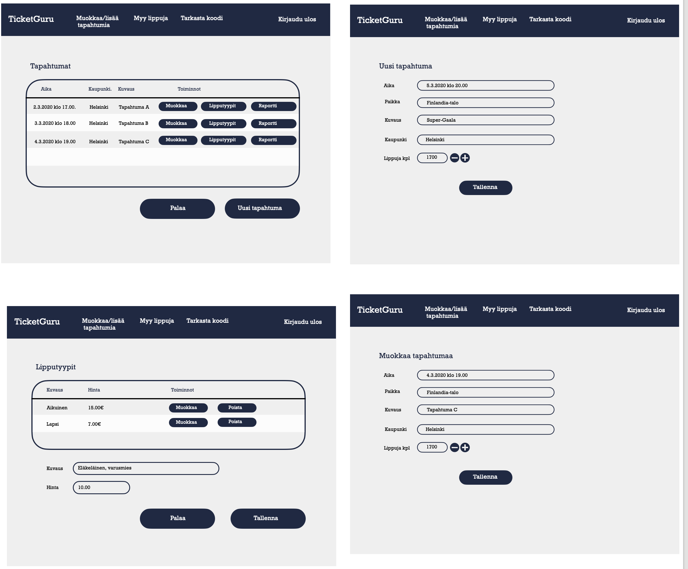
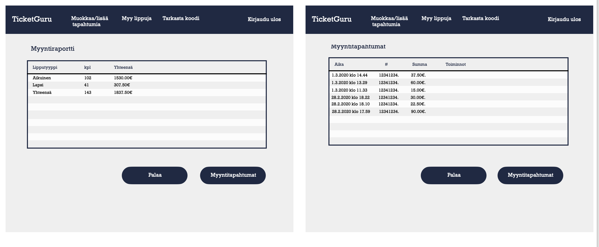

# TicketGuru

Scrummerit4ever: Antti Varis, Matias Nisonen, Roosa Vuorela,
Timo Lampinen, Jeremias Pajari

## Johdanto

TicketGuru on lipunmyyntijärjestelmä, joka on suunniteltu helpottamaan lipunmyyntitoimistojen arkea. Järjestelmä tehostaa lippujen myyntiä, lippujen tulostamista ja niiden tarkastamista tapahtumissaan. TicketGuru-järjestelmä palvelee lipputoimiston eri käyttäjäryhmiä, kuten lipunmyyjiä, tapahtumajärjestäjiä, henkilökuntaa ovella sekä asiakkaita. 

TicketGuru mahdollistaa tapahtuman luomisen ja hallinnan, myyntiraporttien tarkastelun sekä lippujen myynnin. Liput voidaan merkitä käytetyiksi ovella. Myyntipisteessä järjestelmä tukee lippujen tulostamista asikkailleen. Ennakkomyynnistä ylijääneet liput voidaan tulostaa ovelle myytäviksi. Asiakas voi ostaa lipun itselleen lipunmyyntipisteeltä tai tapahtuman ovelta.  

TicketGuru hyödyntää Javaa toimiakseen. Käyttöliittymä on responsiivinen ja toteutetaan nykyaikaisia työkaluja, kuten Reactia käyttämällä. Käyttöliittymää on selkeä navigoida ja sisältää keskeiset toiminnot. Eri käyttäjäryhmille on omat näkymät. Järjestelmän tiedot tallennetaan relaatiotietokantaan.  

## Järjestelmän määrittely

Määrittelyssä järjestelmää tarkastellaan käyttäjän näkökulmasta. Järjestelmän
toiminnot hahmotellaan käyttötapausten tai käyttäjätarinoiden kautta, sekä kuvataan järjestelmän
käyttäjäryhmät.

### Käyttäjäryhmät

**1. Tapahatumanjärjestäjä**

Taho, joka järjestää tapahtuman ja käyttää tapahtuman lipunmyynnissä apuna TicketGuru -ohjelmistoa. Tämä sisältää mm:
- Uuden tapahtuman määrittäminen ja sen luominen järjestelmään
- Jo olemassa olevan tapahtuman tietojen muuttaminen
- Myyntiraportttien tarkastelu

**2. Lipunmyyjä lipunmyyntipisteessä**

Henkilö, joka myy tapahtuman ovella lippuja asiakkaille lipunmyyntipisteessä.
- Tulostaa ostetun lipun asiakkaalle
- Tulostaa myymättä jääneet liput tapahtuman ovella
  
**3. Henkilökunta ovella**
  
Henkilö, joka työskentelee tapahtuman ovella.
- Myy jäljelle jääneitä lippuja asiakkaille ovella
- Merkitsee lipun käytetyksi

**4. Asiakas**

Henkilö, joka ostaa lipun tapahtumaan lipunmyyntipisteestä tai ovelta.

**5. Järjestelmän ylläpitäjä**

Henkilö/taho, joka vastaa ohjelmiston teknisestä ylläpidosta. Esim. käyttäjäryhmien- ja oikeuksien määrittelemisestä.

**6. Tulostin**

Järjestelmäkäyttäjä, jonka kautta tulostetaan ylijääneet liput myytäväksi.

### Käyttötapauskaavio

### Käyttäjätarinat

**Tapahtumajärjestäjänä**, **haluan** tarkistaa liput ovella helposti, **jotta** voin merkitä käytetyt liput ja estää väärinkäytökset.

**Lipputoimiston työntekijänä**, **haluan** nähdä myyntiraportit, **jotta** voin seurata myynnin kehitystä.

**Lippumyyjänä**, **haluan** tulostaa loput ennakkomyynnistä ylijääneet liput, **jotta** voin myydä ne tapahtuman ovella.

**Lipputoimiston työntekijänä**, **haluan** pystyä hallinnoimaan tapahtumia järjestelmässä, **jotta** voin hallita lippuja sekä päivittää tapahtumatietoja.

**Asiakkaana**, **haluan** mahdollisuuden maksaa liput eri maksutavoilla, **jotta** voin valita itselleni sopivan maksutavan.

**Tapahtuman järjestäjänä**, **haluan** määritellä erilaisia lipputyyppejä, **jotta** osaan tarjota oikeanlaisia hintoja eläkeläisille, lapsille sekä opiskelijoille.

**Järjestelmän ylläpitäjänä**, **haluan** määritellä eri käyttäjärooleja, **jotta** voin hallita järjestelmän käyttöoikeuksia turvallisesti.

**Lippumyyjänä**, **haluan** myydä ja tulostaa liput asiakkalle vaivattomasti, **jotta** asiakas saa ostoksensa sujuvasti.

## Käyttöliittymä

**Käyttöliittymä ja lippujen myynti**

**Tapahtumien muokkaminen ja lisääminen**

**Myyntiraportit**

## Tietokanta

> ### _Jarjestajat_
> _Jarjestajat-taulu sisältää organisaatiot, jotka järjestävät tapahtuman. Järjestäjä voi järjestää monta tapahtumaa. Järjestäjillä on yksilöivät tunnisteet._
>
> Kenttä | Tyyppi | Kuvaus
> ------ | ------ | ------
> Jarjestaja_id | int PK | [Jarjestajat](#Jarjestajat)-taulun yksilöivä  tunniste ja samalla primary key
> Nimi | Varchar(30) | Järjestäjä organisaation nimi
> Yhteyshenkilo_id | int FK | Viittaus [Kayttajat](#Kayttajat)-taulun kayttaja_id:hen
> Katuosoite | varchar(30) | Järjestäjä organisaation toimipisteen osoite
> Postinumero | varchar FK | Viittaus [Postitoimipaikat](#Postitoimipaikat)-taulun, postinumero avaimeen
>
> ### _Postitoimipaikat_
> _Postitoimipaikat-taulu sisältää postitoimipaikkoja._
>
> Kenttä | Tyyppi | Kuvaus
> ------ | ------ | ------
> Postinumero | varchar PK | [Postitoimipaikat](#Postitoimipaikat)-taulun yksilöivä avain
> Postitoimipaikka | varchar(30) | Postitoimipaikan paikkakunta
> Maa | varchar(30) | Postitoimipaikan maa
>
> ### _Lipputyypit_
> _Lipputyypit-taulu sisältää lipputyyppien vaihtoehdot._
>
> Kenttä | Tyyppi | Kuvaus
> ------ | ------ | ------
> Lipputyyppi_id | int PK, not null | Lipputyypin yksilöivä avain/id
> Lipputyyppi | varchar(30), not null | Lipptyypin nimi, esim. aikuinen, eläkeläinen, opsikelija, lapsi
> 
> ### _Tilat_
> _Tilat-taulu sisältää lippujen eri tila-vaihtoehdot._
>
> Kenttä | Tyyppi | Kuvaus
> ------ | ------ | ------
> Tila_id | int PK | Tilan yksilöivä avain/id
> Tila | varchar(30) | Tilan nimi, esim. myymättä, myyty, tarkastettu, peruttu
>
> ### _Liput_
> _Liput-taulu sisältää yksilölliset liput. Jokainen lippu liittyy vain yhteen tapahtumaan, tyyppiin, lipputyyppiin, tilaan ja käyttäjään._
>
> Kenttä | Tyyppi | Kuvaus
> ------ | ------ | ------
> Lippu_id | int PK, not null | Lipun yksilöivä avain/id
> Tapahtuma_lipputyyppi_id | int FK, not null | Tapahtuma + lipputyyppi, viittaus [Tapahtuman_lipputyypit](#Tapahtuman_lipputyypit)-tauluun
> Hinta | decimal(2) | Lipun lopullinen myyntihinta
> Tila_id | int FK | Lipun tila, viittaus [Tilat](#Tilat)-tauluun
> Tarkastanut_id | int FK | Lipun tarkastanut henkilö, viittaus käyttäjään [Kayttajat](#Kayttajat)-taulussa
> Tarkistus_pvm | date | Päivämäärä, jolloin lippu on tarkasettu ovella, eli käytetty
> Myynti_id | int, FK, not null | Myyntitapahtuma, johon lippu liittyy, viittaus [Myynnit](#Myynnit)-tauluun
>
> ### _Tapahtuman_lipputyypit_
> _Tapahtuman_lipputyypit-taulu sisältää tietoa siitä millaisia lippuja mihinkin tapahtumaan on myynnissä ja paljonko ne maksavat._
>
> Kenttä | Tyyppi | Kuvaus 
> ------ | ------ | ------
> Tapahtuma_lipputyyppi_id | int, PK, NOT NULL | Yksilöivä tunniste ja primary key 
> Tapahtuma_id | int, FK, NOT NULL | Viittaus [Tapahtumat](#Tapahtumat) -tauluun
> Lipputyyppi_id | int, FK, NOT NULL | Viittaus [Lipputyypit](#Lipputyypit) -tauluun
> Hinta | decimal(2), NOT NULL | Lipun myyntihinta
>
> ### _Tapahtumat_
> _Tapahtumat-taulu sisältää tapahtumat, jotka järjestetään tietyssä paikassa tietyllä päivämäärällä. Tapahtumalla on myös kuvaus ja viittaus järjestäjään. Tapahtumilla on yksilöivät tunnisteet._
>
> Kenttä | Tyyppi | Kuvaus
> ------ | ------ | ------
> Tapahtuma_id | int PK | [Tapahtumat](#Tapahtumat)-taulun yksilöivä tunnisste ja samalla primary key
> Nimi | Varchar(200) | Tapahtuman nimi
> Paivamaara | date | Päivämäärä ja kellonaika, jolloin tapahtuma alkaa
> Kuvaus | varchar(2500) | Tapahtuman kuvaus
> Tapahtumapaikka | int FK | Viittaus [Tapahtumapaikat](#Tapahtumapaikat)-taulun, Tapahtumapaikka_id avaimeen
> Jarjestaja_id | int FK | Tapahtuman järjestäjä. Viittaus [Jarjestajat](#jarjestajat)-tauluun
> Lippumaara | int, not null | Tapahtumaan myytävien lippujen määrä
>
> ### _Tapahtumapaikat_
> _Tapahtumapaikat-taulu sisältää paikat, joissa tapahtumat järjestetään. Nimen lisäksi se sisältää osoitteen, viittauksen postinumerotauluun ja ihmisten maksimimäärän._
>
> Kenttä | Tyyppi | Kuvaus
> ------ | ------ | ------
> Tapahtumapaikka_id | int PK | [Tapahtumapaikat](#Tapahtumapaikat)-taulun yksilöivä tunnisste ja samalla primary key
> Nimi | Varchar(200) | Paikan nimi
> Katuosoite | varchar(30) | Tapahtumapaikan osoite
> Postinumero | int FK | Viittaus [Postitoimipaikat](#Postitoimipaikat)-taulun, postinumero avaimeen
> Maksimi_osallistujat | int | Maksimimmäärä, mitä paikassa saa olla ihmisiä mukaanlukien esiintyjät, henkilökunta ja lipun ostajat
>
> ### _Kayttajat_
> _Kayttajat-taulu sisältää tietoa liittyen yksittäiseen käyttäjään. Käyttäjiä voivat olla esim. lipunmyyjä, asiakas sekä ylläpitäjä._
>
> Kenttä | Tyyppi | Kuvaus
> ------ | ------ | ------
> Kayttaja_id | int, autonumber, PK, not null | Yksiloiva tunniste ja primary key.
> Kayttajatunnus | varchar(100), not null | Käyttäjätunnus
> Salasana_hash | varchar(60), not null | Salasanan hash
> Etunimi | varchar(100) | Käyttäjän etunimi
> Sukunimi | varchar(100) | Käyttäjän sukunimi
> Puh_nro | varchar(20) | Käyttäjän puhelinnumero
> Email | varchar(100) | Käyttäjän sähköpostiosoite
> Katuosoite | varchar(100) | Käyttäjän katuosoite
> Postinumero | varchar(6), FK | Käyttäjän postinumero, viittaus [Postitoimipaikat](#postitoimipaikat)-tauluun
> Kayttajatyyppi_id | int, not null, FK | Käyttäjän tyyppi, viittaus [Käyttäjätyypit](#kayttajatyypit)-tauluun
>
> ### Kayttajatyypit
> Kayttajatyypit-taulu sisältää tietoa erilaisista kayttajatyypeista.
>
> Kenttä | Tyyppi | Kuvaus
> ------ | ------ | ------
> Kayttajatyyppi_id | int, autonumber, PK, not null | Yksilöivä tunniste ja primary key
> Kayttajatyyppi | varchar(20), not null |  Kayttajatyypin nimi esim. asiakas, lipuntarkastaja, lipunmyyjä, tapahtumavastaava tai ylläpitäjä.
> Kuvaus | varchar(500) | Vapaaehtoinen kuvaus käyttäjätyypille
>
> ### _Myynnit_
> _Myynnit-taulu sisältää tietoa lippujen myymisestä asiakkaalle (myyntitapahtumat)._
>
> Kenttä | Tyyppi | Kuvaus 
> ------ | ------ | ------
> Myynti_id | int, PK, NOT NULL | Yksilöivä tunniste ja primary key 
> Asiakas_id | int, FK | Viittaus [Kayttajat](#Kayttaja_id) -tauluun
> Myyntipaiva | date, NOT NULL | Päivämäärä sekä kellonaika jolloin myynti tapahtui
> Myyntipiste_id | int, FK, NOT NULL | Viittaus [Myyntipisteet](#Myyntipiste_id) -tauluun
> Maksutapa_id | int, FK, NOT NULL | Maksutapa, viittaus [Maksutavat](#Maksutavat) -tauluun
>
> ### _Maksutavat_
> _Maksutavat_-taulu sisältää tietoa maksutavoista
>
> Kenttä | Tyyppi | Kuvaus
> ------ | ------ | ------
> Maksutapa_id | int, PK, NOT NULL | Yksilöivä tunniste ja primary key 
> Maksutapa | varchar(100), NOT NULL | Maksutapa
>
> ### _Myyntipisteet_
> _Myyntipisteet-taulu sisältää tietoa myyntipisteistä_
>
> Kenttä | Tyyppi | Kuvaus
> ------ | ------ | ------
> Myyntipiste_id | int, PK, NOT NULL | Yksilöivä tunniste ja primary key 
> Nimi | varchar(100), NOT NULL | Myyntipisteen nimi
> Katuosoite | varchar(100), NOT NULL | Myyntipisteen katuosoite
> Postinumero | int, FK, NOT NULL | Viittaus [Postitoimipaikat](#Postinumero) - tauluun

## Tekninen kuvaus

Teknisessä kuvauksessa esitetään järjestelmän toteutuksen suunnittelussa tehdyt tekniset
ratkaisut, esim.

-   Missä mikäkin järjestelmän komponentti ajetaan (tietokone, palvelinohjelma)
    ja komponenttien väliset yhteydet (vaikkapa tähän tyyliin:
    https://security.ufl.edu/it-workers/risk-assessment/creating-an-information-systemdata-flow-diagram/)
-   Palvelintoteutuksen yleiskuvaus: teknologiat, deployment-ratkaisut yms.
-   Keskeisten rajapintojen kuvaukset, esimerkit REST-rajapinta. Tarvittaessa voidaan rajapinnan käyttöä täsmentää
    UML-sekvenssikaavioilla.
-   Toteutuksen yleisiä ratkaisuja, esim. turvallisuus.

Tämän lisäksi

-   ohjelmakoodin tulee olla kommentoitua
-   luokkien, metodien ja muuttujien tulee olla kuvaavasti nimettyjä ja noudattaa
    johdonmukaisia nimeämiskäytäntöjä
-   ohjelmiston pitää olla organisoitu komponentteihin niin, että turhalta toistolta
    vältytään

## Testaus

Tässä kohdin selvitetään, miten ohjelmiston oikea toiminta varmistetaan
testaamalla projektin aikana: millaisia testauksia tehdään ja missä vaiheessa.
Testauksen tarkemmat sisällöt ja testisuoritusten tulosten raportit kirjataan
erillisiin dokumentteihin.

Tänne kirjataan myös lopuksi järjestelmän tunnetut ongelmat, joita ei ole korjattu.

## Asennustiedot

Järjestelmän asennus on syytä dokumentoida kahdesta näkökulmasta:

-   järjestelmän kehitysympäristö: miten järjestelmän kehitysympäristön saisi
    rakennettua johonkin toiseen koneeseen

-   järjestelmän asentaminen tuotantoympäristöön: miten järjestelmän saisi
    asennettua johonkin uuteen ympäristöön.

Asennusohjeesta tulisi ainakin käydä ilmi, miten käytettävä tietokanta ja
käyttäjät tulee ohjelmistoa asentaessa määritellä (käytettävä tietokanta,
käyttäjätunnus, salasana, tietokannan luonti yms.).

## Käynnistys- ja käyttöohje

Tyypillisesti tässä riittää kertoa ohjelman käynnistykseen tarvittava URL sekä
mahdolliset kirjautumiseen tarvittavat tunnukset. Jos järjestelmän
käynnistämiseen tai käyttöön liittyy joitain muita toimenpiteitä tai toimintajärjestykseen liittyviä asioita, nekin kerrotaan tässä yhteydessä.

Usko tai älä, tulet tarvitsemaan tätä itsekin, kun tauon jälkeen palaat
järjestelmän pariin !
